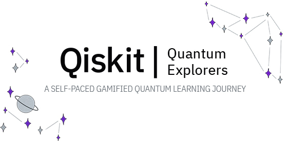

# Quantum Explorers

Quantum Explorers is a self-paced, game-based quantum computing learning program for high school students and above. The theme of the learning journey is space exploration. You’ll embark on an interstellar journey as the captain of a starship and grow proficiency in quantum computing along the way.

Participants will gain a general understanding of quantum computing, learn some of its applications such as quantum machine learning and quantum optimization, and program real quantum computers.

There are seven themed achievements to unlock with corresponding badges to collect. Each badge has a learning module, event, or set of tasks associated with it that must be completed in order to unlock its achievement. The program culminates in a certification based on how many badges you collect.

In the section of Workbook, you will find the instruction and information for each badge. My solution can be found in solutions with each badge that I have achieved during the game. Unfortunately, I couldn't achieve the last one... Too difficult for me :-). At the end, I receive an IBM [badge intermediate in Quantum Computing](https://www.credly.com/badges/1559e3df-25da-4c98-b209-bc2cb54b897d/public_url) 

Event website: [qisk.it/quantum-explorers](http://qisk.it/quantum-explorers).

